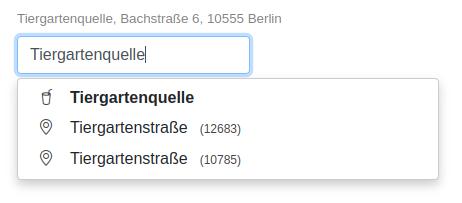

# berlinplaces

<!--

-->

REST-Service for autocompletion and geocoding of places and addresses in Berlin.

berlinplaces is essentially me playing around with [Open Street Map](https://wiki.osmfoundation.org/wiki/Main_Page)
data. The goal is (was), to imitate Google's [Places Autocomplete](https://developers.google.com/maps/documentation/javascript/places-autocomplete#introduction)
(-API) without the strings attached. That is, provide an API that is free (beer and speech), has a low latency, has a 
good "hit rate" (e.g. compensates typos), and is slim and easy in terms of deployment. 

Thus here it is, berlinplaces is:

- free: it's here and OSS
- latency: basic tests show ~200µs without typos and ~12ms with early typos (if completed first time)
- hit rate: berlinplaces uses lookup tables for speed and Levenshtein for typos
- slim and easy: 35MB Docker image (incl. (REST-) server, OSM-data (!), swagger-docs and demo website) 

The demo (see below) looks like:

## Getting Started

### Getting Sources

First, clone the repo and switch into the new directory:

~~~~bash
git clone git@github.com:heimdalr/berlinplaces.git
cd berlinplaces
~~~~

### Build and Run

Inside the directory (`berlinplaces`), build and run via Docker:

~~~~bash
docker build -t berlinplaces .
docker run -p 8080:8080 -e PLACES_DEBUG=true --name berlinplaces berlinplaces
~~~~

or have  [Go](https://go.dev/) >= 1.17 installed and run: 

~~~~bash
go build -o berlinplaces .
./berlinplaces 
~~~~

### API Usage

After the service is up and running (via docker or local), run (e.g.):

~~~~bash
curl --request GET --url 'http://localhost:8080/places?text=Tiergartenq' | jq
~~~~

which will result in something like:

~~~~json
[
  {
    "distance": 4,
    "place": {
      "id": 10561,
      "class": "street",
      "name": "Tiergartenufer",
      "postcode": "10623",
      "district": "Charlottenburg-Wilmersdorf",
      "length": 236,
      "lat": 52.513022715666686,
      "lon": 13.333934396722077,
      "relevance": 0
    }
  },
  {
    "distance": 5,
    "place": {
      "id": 13969,
      "class": "location",
      "type": "restaurant",
      "name": "Tiergartenquelle",
      "street": "Bachstraße",
      "streetID": 1012,
      "houseNumber": "6",
      "postcode": "10555",
      "district": "Mitte",
      "lat": 52.5151591,
      "lon": 13.3367789,
      "relevance": 0
    }
  }
]
~~~~

The API spec is thereby served at <http://localhost:8080/swagger>.

Note, whether the API spec is being served is controlled via the environment variable `PLACES_SPEC` (and defaults
depend on `PLACES_DEBUG`).

### DEMO

To see a demo website using the API for a location / address input, surf to <http://localhost:8080/demo>.

Note, whether the demo website is being served is controlled via the environment variable `PLACES_DEMO` (and defaults 
depend on `PLACES_DEBUG`). 

## OSM Data

The repository at hand contains "mangled" OSM data for Berlin (`_data/*.csv`) - hence berlinplaces. 

See [`_data/README.md`](_data/README.md) for how to generate those CSV files.  

[//]: ## Readings
[//]: 
[//]: ### Typeahead and Bloodhound
[//]: - <https://digitalfortress.tech/tutorial/smart-search-using-twitter-typeahead-bloodhound/>
[//]: - <https://twitter.github.io/typeahead.js/examples/>
[//]: - <https://medium.com/@miPriyesh/typeahead-bloodhound-and-onemap-api-2-0-b968d8576fa1>
[//]: - <https://stackoverflow.com/questions/41333654/type-ahead-bloodhound-sort-return-values>
[//]: - <https://github.com/corejavascript/typeahead.js>
[//]: - <https://github.com/corejavascript/typeahead.js/blob/a03813e3c204006b485d1aefe06b99834b13f457/dist/typeahead.jquery.js>
[//]: - <https://bl.ocks.org/wheresjames/9643ce9d0a83ef30b36fc16d5a18e0ac>
[//]: - <https://stackoverflow.com/questions/12662824/twitter-bootstrap-typeahead-multiple-values>
[//]: 
[//]: ### PostGIS
[//]: 
[//]: - <https://help.openstreetmap.org/questions/38985/how-to-get-all-addrstreet-addrhousenumber-addrcity>
[//]: - <http://postgis.net/workshops/postgis-intro/geometries.html>
[//]: - <https://gis.stackexchange.com/questions/16698/join-intersecting-lines-with-postgis>
[//]: - <https://gis.stackexchange.com/questions/94203/grouping-connected-linestrings-in-postgis>
[//]: 
[//]: 
[//]: # (## Latency)
[//]: 
[//]: # ()
[//]: # (In the following we look at different lookup latency based on:)
[//]: 
[//]: # ()
[//]: # (- `maxPrefixLength = 6` &#40;maximum prefix length&#41;)
[//]: 
[//]: # (- `minCompletionCount = 6` &#40;the minimum number of completions to compute&#41;)
[//]: 
[//]: # (- `levMinimum = 0` &#40;the minimum input length before doing Levenshtein&#41;)
[//]: 
[//]: # ()
[//]: # (Essential basic tests show ~200µs without typos and ~12ms with early typos &#40;if completed first time&#41; &#40;locally, on an )
[//]: 
[//]: # (i5-4670S&#41;.)
[//]: 
[//]: # ()
[//]: # (Each of the following tests was thereby started with an empty cache.)
[//]: 
[//]: # ()
[//]: # (### Without Typos)
[//]: 
[//]: # ()
[//]: # (Autocompleting on "oranienburgerstraße":)
[//]: 
[//]: # ()
[//]: # (~~~~)
[//]: 
[//]: # ([GIN] | 200 | 451.966µs | GET "/api/complete?text=o")
[//]: 
[//]: # ([GIN] | 200 | 294.185µs | GET "/api/complete?text=or")
[//]: 
[//]: # ([GIN] | 200 | 218.059µs | GET "/api/complete?text=ora")
[//]: 
[//]: # ([GIN] | 200 | 165.204µs | GET "/api/complete?text=oran")
[//]: 
[//]: # ([GIN] | 200 | 159.364µs | GET "/api/complete?text=orani")
[//]: 
[//]: # ([GIN] | 200 | 226.237µs | GET "/api/complete?text=oranie")
[//]: 
[//]: # ([GIN] | 200 | 130.319µs | GET "/api/complete?text=oranien")
[//]: 
[//]: # ([GIN] | 200 | 182.936µs | GET "/api/complete?text=oranienb")
[//]: 
[//]: # ([GIN] | 200 | 600.928µs | GET "/api/complete?text=oranienbu")
[//]: 
[//]: # ([GIN] | 200 | 140.496µs | GET "/api/complete?text=oranienbur")
[//]: 
[//]: # ([GIN] | 200 | 203.542µs | GET "/api/complete?text=oranienburg")
[//]: 
[//]: # ([GIN] | 200 | 205.985µs | GET "/api/complete?text=oranienburge")
[//]: 
[//]: # ([GIN] | 200 | 130.145µs | GET "/api/complete?text=oranienburger")
[//]: 
[//]: # ([GIN] | 200 |  191.65µs | GET "/api/complete?text=oranienburgers")
[//]: 
[//]: # ([GIN] | 200 | 154.832µs | GET "/api/complete?text=oranienburgerst")
[//]: 
[//]: # ([GIN] | 200 | 129.335µs | GET "/api/complete?text=oranienburgerstr")
[//]: 
[//]: # ([GIN] | 200 |  262.72µs | GET "/api/complete?text=oranienburgerstra")
[//]: 
[//]: # ([GIN] | 200 | 121.913µs | GET "/api/complete?text=oranienburgerstra%C3%9F")
[//]: 
[//]: # ([GIN] | 200 | 147.085µs | GET "/api/complete?text=oranienburgerstra%C3%9Fe")
[//]: 
[//]: # (~~~~)
[//]: 
[//]: # ()
[//]: # (The average response time over all 20 calls &#40;one for each character typed&#41; is ~220µs. )
[//]: 
[//]: # ()
[//]: # (The correct "Oranienburger Straße" is suggested after typing "oranien" and at the top of the suggestion list after )
[//]: 
[//]: # (typing "oranienburger s".)
[//]: 
[//]: # ()
[//]: # (### Early Typos )
[//]: 
[//]: # ()
[//]: # (Early typos are typos that occur inside the prefix lookup.)
[//]: 
[//]: # ()
[//]: # (Autocompleting on "oanienburgerstraße" &#40;note the missing "r" in the beginning&#41;:)
[//]: 
[//]: # ()
[//]: # (~~~~)
[//]: 
[//]: # ([GIN] | 200 |   422.906µs | GET "/api/?text=o")
[//]: 
[//]: # ([GIN] | 200 |   210.837µs | GET "/api/?text=oa")
[//]: 
[//]: # ([GIN] | 200 |  9.644704ms | GET "/api/?text=oan")
[//]: 
[//]: # ([GIN] | 200 |  10.18646ms | GET "/api/?text=oani")
[//]: 
[//]: # ([GIN] | 200 | 10.554832ms | GET "/api/?text=oanie")
[//]: 
[//]: # ([GIN] | 200 | 11.641434ms | GET "/api/?text=oanien")
[//]: 
[//]: # ([GIN] | 200 | 10.935276ms | GET "/api/?text=oanienb")
[//]: 
[//]: # ([GIN] | 200 | 12.162737ms | GET "/api/?text=oanienbu")
[//]: 
[//]: # ([GIN] | 200 | 12.863149ms | GET "/api/?text=oanienbur")
[//]: 
[//]: # ([GIN] | 200 | 14.113217ms | GET "/api/?text=oanienburg")
[//]: 
[//]: # ([GIN] | 200 | 12.674369ms | GET "/api/?text=oanienburge")
[//]: 
[//]: # ([GIN] | 200 | 13.981331ms | GET "/api/?text=oanienburger")
[//]: 
[//]: # ([GIN] | 200 | 14.620061ms | GET "/api/?text=oanienburgers" --> visible)
[//]: 
[//]: # ([GIN] | 200 | 16.405334ms | GET "/api/?text=oanienburgerst" --> at top)
[//]: 
[//]: # ([GIN] | 200 | 15.504753ms | GET "/api/?text=oanienburgerstr")
[//]: 
[//]: # ([GIN] | 200 | 19.162968ms | GET "/api/?text=oanienburgerstra")
[//]: 
[//]: # ([GIN] | 200 | 17.305315ms | GET "/api/?text=oanienburgerstra%C3%9F")
[//]: 
[//]: # ([GIN] | 200 | 19.710446ms | GET "/api/?text=oanienburgerstra%C3%9Fe")
[//]: 
[//]: # (~~~~)
[//]: 
[//]: # ()
[//]: # (Early typos ruin the lookup. The average response time over all 18 calls is ~12ms. )
[//]: 
[//]: # ()
[//]: # (The correct "Oranienburger Straße" is suggested after typing "oanienburgers" and)
[//]: 
[//]: # (at the top of the suggestion list after typing "oanienburgerst".)
[//]: 
[//]: # ()
[//]: # (In this case, there are no prepared completion for the prefix "oa" &#40;and)
[//]: 
[//]: # (following&#41;. Thus, berlinplaces does Levenshtein on the complete set for this)
[//]: 
[//]: # (call and all subsequent prefixes.)
[//]: 
[//]: # ()
[//]: # (### Repeated Early Typos)
[//]: 
[//]: # ()
[//]: # (Early typos ruin the lookup. However, berlinplaces caches the results of input)
[//]: 
[//]: # (completions for faulty inputs and inputs longer than the configured)
[//]: 
[//]: # (`maxPrefixLength`. Thus running the same faulty input &#40;"oanienburgerstraße"&#41;)
[//]: 
[//]: # (again, results in an average response-time of 194µs.)
[//]: 
[//]: # ()
[//]: # (### Late Typos)
[//]: 
[//]: # ()
[//]: # (Late typos are typos that occur outside / after the prefix lookup.)
[//]: 
[//]: # ()
[//]: # (Autocompleting on "oranienurgerstarße" &#40;note the missing "b" and the flipped)
[//]: 
[//]: # ("ar" vs. "ra"&#41;:)
[//]: 
[//]: # ()
[//]: # (~~~~)
[//]: 
[//]: # ([GIN] | 200 | 249.977µs | GET "/api/?text=o")
[//]: 
[//]: # ([GIN] | 200 | 358.533µs | GET "/api/?text=or")
[//]: 
[//]: # ([GIN] | 200 | 159.317µs | GET "/api/?text=ora")
[//]: 
[//]: # ([GIN] | 200 | 297.679µs | GET "/api/?text=oran")
[//]: 
[//]: # ([GIN] | 200 | 225.726µs | GET "/api/?text=orani")
[//]: 
[//]: # ([GIN] | 200 | 228.456µs | GET "/api/?text=oranie")
[//]: 
[//]: # ([GIN] | 200 | 162.784µs | GET "/api/?text=oranien" --> visible)
[//]: 
[//]: # ([GIN] | 200 | 169.192µs | GET "/api/?text=oranienu")
[//]: 
[//]: # ([GIN] | 200 | 195.499µs | GET "/api/?text=oranienur")
[//]: 
[//]: # ([GIN] | 200 | 211.435µs | GET "/api/?text=oranienurg")
[//]: 
[//]: # ([GIN] | 200 | 138.643µs | GET "/api/?text=oranienurge")
[//]: 
[//]: # ([GIN] | 200 |  165.08µs | GET "/api/?text=oranienurger")
[//]: 
[//]: # ([GIN] | 200 | 200.702µs | GET "/api/?text=oranienurgers")
[//]: 
[//]: # ([GIN] | 200 | 182.195µs | GET "/api/?text=oranienurgerst" --> at top)
[//]: 
[//]: # ([GIN] | 200 | 163.033µs | GET "/api/?text=oranienurgersta")
[//]: 
[//]: # ([GIN] | 200 | 208.039µs | GET "/api/?text=oranienurgerstar")
[//]: 
[//]: # ([GIN] | 200 | 302.667µs | GET "/api/?text=oranienurgerstar%C3%9F")
[//]: 
[//]: # ([GIN] | 200 | 162.801µs | GET "/api/?text=oranienurgerstar%C3%9Fe")
[//]: 
[//]: # (~~~~)
[//]: 
[//]: # ()
[//]: # (Late typos are cheap as Levenshtein will only be done on the completion set delivered by the prefix lookup. The average )
[//]: 
[//]: # (response time over all 18 calls is in this case ~210µs &#40;essentially the same as for no typos&#41;.)
[//]: 
[//]: # ()
[//]: # (The correct "Oranienburger Straße" is suggested after typing "oranien" and at the top of the suggestion list after)
[//]: 
[//]: # (typing "oranienurgerst".)

