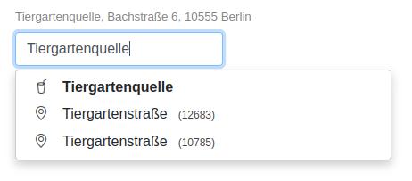

# berlinplaces

<!--

-->

REST-Service for autocompletion and geocoding of places and addresses in Berlin.

berlinplaces is essentially me playing around with [Open Street Map](https://wiki.osmfoundation.org/wiki/Main_Page)
data. The goal is (was), to imitate Google's [Places Autocomplete](https://developers.google.com/maps/documentation/javascript/places-autocomplete#introduction)
(-API) without the strings attached. That is, provide an API that is free (beer and speech), has a low latency, has a 
good "hit rate" (e.g. compensates typos), and is slim and easy in terms of deployment. 

Thus here it is, berlinplaces is:

- free: it's here and OSS
- [latency](#latency): basic tests show ~4ms without typos ~13ms with early typos (locally, on an i5-4670S)
- hit rate: berlinplaces uses lookup tables for speed and Levenshtein for typos
- slim and easy: 25MB Docker image (incl. REST-server, OSM-data, swagger-docs and example website) 

The demo (see below) looks like:

  
## Getting Started

Have [Go](https://go.dev/) >= 1.17 installed and run: 

~~~~bash
git clone git@github.com:heimdalr/berlinplaces.git
cd berlinplaces
go build -o berlinplaces .
./berlinplaces 
~~~~

and surf to:

- <http://localhost:8080/web> - demo website or
- <http://localhost:8080/swagger> - the OpenAPI spec

alternatively run (e.g.): 

~~~~bash
curl --request GET --url 'http://localhost:8080/api/?text=Oranienbur' | jq
~~~~

which will result in something like:

~~~~json
[
  {
    "distance": 10,
    "percentage": 0,
    "place": {
      "placeID": "596345",
      "parentPlaceID": "732833",
      "osmID": "",
      "class": "highway",
      "type": "primary",
      "name": "Oranienburger Straße",
      "street": "",
      "houseNumber": "",
      "suburb": "",
      "postcode": "13437",
      "city": "Berlin",
      "lat": "52.5979629",
      "lon": "13.3324627"
    }
  },
  {
    "distance": 12,
    "percentage": 0,
    "place": {
      "placeID": "722480",
      "parentPlaceID": "491443",
      "osmID": "",
      "class": "highway",
      "type": "primary",
      "name": "Oranienburger Chaussee",
      "street": "",
      "houseNumber": "",
      "suburb": "",
      "postcode": "13465",
      "city": "Berlin",
      "lat": "52.6300644",
      "lon": "13.3105084"
    }
  }
]
~~~~

## OSM Data

The repository at hand contains prepared OSM data ([`berlin.csv`](berlin.csv)). 

See [`_data/README.md`](_data/README.md) for how to generate this CSV file.  

## Latency

In the following we look at different lookup latency based on:

- `maxPrefixLength = 6` (maximum prefix length)
- `minCompletionCount = 6` (the minimum number of completions to compute)
- `levMinimum = 4` (the minimum input length before doing Levenshtein)

Essential basic tests show ~4ms without typos ~13ms with early typos (locally, on an i5-4670S).

### Without typos

Autocompleting on "Oranienburger Straße":

~~~~
[GIN] | 200 |    98.225µs | GET "/api/?text=O"
[GIN] | 200 |   132.447µs | GET "/api/?text=Or"
[GIN] | 200 |   196.676µs | GET "/api/?text=Ora"
[GIN] | 200 | 12.171822ms | GET "/api/?text=Oran"
[GIN] | 200 |  9.760198ms | GET "/api/?text=Orani"
[GIN] | 200 | 12.131769ms | GET "/api/?text=Oranie"
[GIN] | 200 | 11.454423ms | GET "/api/?text=Oranien"
[GIN] | 200 | 14.378563ms | GET "/api/?text=Oranienb"
[GIN] | 200 | 13.360054ms | GET "/api/?text=Oranienbu"
[GIN] | 200 |   242.337µs | GET "/api/?text=Oranienbur" --> hit
[GIN] | 200 |   249.432µs | GET "/api/?text=Oranienburg"
[GIN] | 200 |   116.952µs | GET "/api/?text=Oranienburge"
[GIN] | 200 |   283.652µs | GET "/api/?text=Oranienburger"
[GIN] | 200 |   150.084µs | GET "/api/?text=Oranienburger%20"
[GIN] | 200 |   259.917µs | GET "/api/?text=Oranienburger%20S"
[GIN] | 200 |   217.059µs | GET "/api/?text=Oranienburger%20St"
[GIN] | 200 |    90.216µs | GET "/api/?text=Oranienburger%20Str"
[GIN] | 200 |   232.979µs | GET "/api/?text=Oranienburger%20Stra"
[GIN] | 200 |   227.694µs | GET "/api/?text=Oranienburger%20Stra%C3%9F"
[GIN] | 200 |   218.009µs | GET "/api/?text=Oranienburger%20Stra%C3%9Fe"
~~~~

The average response time over all 20 calls (one for each character typed) is ~4ms. Thereby, 75% of the calls being 
below 300µs. 

The correct suggestion ("Oranienburger Straße") is at the top of the suggestion list at "Oranienbur".

### Early typos

Early typos are typos that occur inside the prefix lookup.

Autocompleting on "Oanienburger Straße" (note the missing "r" in the beginning):

~~~~
[GIN] | 200 |   136.864µs | GET "/api/?text=O"
[GIN] | 200 |    131.38µs | GET "/api/?text=Oa" --> typo
[GIN] | 200 |   199.408µs | GET "/api/?text=Oan"
[GIN] | 200 |   9.56753ms | GET "/api/?text=Oani"
[GIN] | 200 |  10.38266ms | GET "/api/?text=Oanie"
[GIN] | 200 | 10.700629ms | GET "/api/?text=Oanien"
[GIN] | 200 | 13.241921ms | GET "/api/?text=Oanienb"
[GIN] | 200 |  12.87358ms | GET "/api/?text=Oanienbu"
[GIN] | 200 | 13.727016ms | GET "/api/?text=Oanienbur"
[GIN] | 200 | 12.197128ms | GET "/api/?text=Oanienburg"
[GIN] | 200 | 15.815339ms | GET "/api/?text=Oanienburge"
[GIN] | 200 | 14.584504ms | GET "/api/?text=Oanienburger"
[GIN] | 200 | 15.288759ms | GET "/api/?text=Oanienburger%20"
[GIN] | 200 | 16.860657ms | GET "/api/?text=Oanienburger%20S" --> hit
[GIN] | 200 | 19.393715ms | GET "/api/?text=Oanienburger%20St"
[GIN] | 200 | 16.849763ms | GET "/api/?text=Oanienburger%20Str"
[GIN] | 200 | 19.339119ms | GET "/api/?text=Oanienburger%20Stra"
[GIN] | 200 | 17.850605ms | GET "/api/?text=Oanienburger%20Stra%C3%9F"
[GIN] | 200 | 19.156892ms | GET "/api/?text=Oanienburger%20Stra%C3%9Fe"
~~~~

Early typos ruine the lookup. The average response time over all 19 calls (one for each character typed) is ~13ms. 

The correct suggestion is at the top of the suggestion list at "Oanienburger S".

In this case, there are no there are no prepared completion for the prefix "Oani". Thus berlinplaces does Levenshtein
the complete set for this call and all subsequent calls.(see [this](https://github.com/heimdalr/berlinplaces/issues/1) 
issue.)

### Late typos

Late typos are typos that occur outside / after the prefix lookup.  

Autocompleting on "Oranienburge Straße" (note the missing "r" in before "Straße"):

~~~~
[GIN] | 200 |    412.536µs | GET "/api/?text=O"
[GIN] | 200 |    236.567µs | GET "/api/?text=Or"
[GIN] | 200 |    152.589µs | GET "/api/?text=Ora"
[GIN] | 200 |   9.319981ms | GET "/api/?text=Oran"
[GIN] | 200 |  12.873608ms | GET "/api/?text=Orani"
[GIN] | 200 |  11.515852ms | GET "/api/?text=Oranie"
[GIN] | 200 |  12.131168ms | GET "/api/?text=Oranien"
[GIN] | 200 |  12.810048ms | GET "/api/?text=Oranienb"
[GIN] | 200 |  12.701407ms | GET "/api/?text=Oranienbu"
[GIN] | 200 |     193.64µs | GET "/api/?text=Oranienbur" --> hit
[GIN] | 200 |    169.208µs | GET "/api/?text=Oranienburg"
[GIN] | 200 |    232.954µs | GET "/api/?text=Oranienburge"
[GIN] | 200 |    130.503µs | GET "/api/?text=Oranienburge%20"
[GIN] | 200 |    185.904µs | GET "/api/?text=Oranienburge%20S"
[GIN] | 200 |    230.252µs | GET "/api/?text=Oranienburge%20St"
[GIN] | 200 |    187.342µs | GET "/api/?text=Oranienburge%20Str"
[GIN] | 200 |    229.589µs | GET "/api/?text=Oranienburge%20Stra"
[GIN] | 200 |     247.05µs | GET "/api/?text=Oranienburge%20Stra%C3%9F"
[GIN] | 200 |    178.127µs | GET "/api/?text=Oranienburge%20Stra%C3%9Fe"
~~~~

Late typos are cheap as Levenshtein will only be done on the completion set delivered by the prefix lookup. The average 
response time over all 19 calls is in this case ~4ms (essentially the same as for no typos).

The correct suggestion is at the top of the suggestion list at "Oranienbur".

